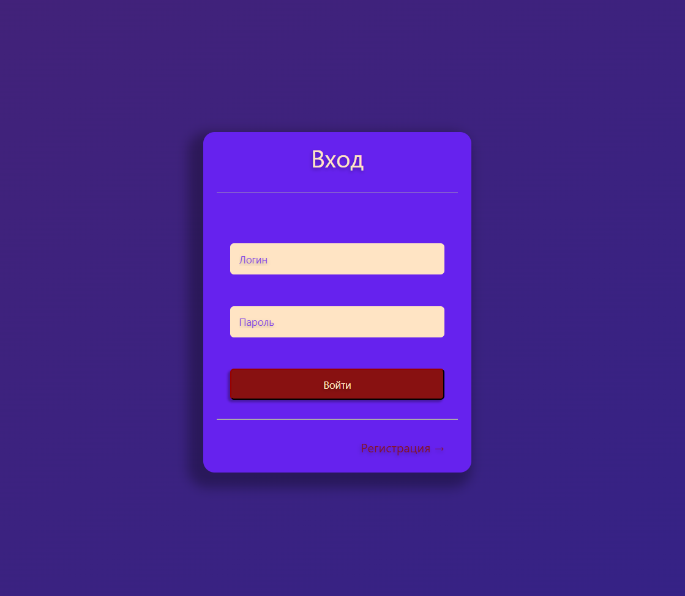
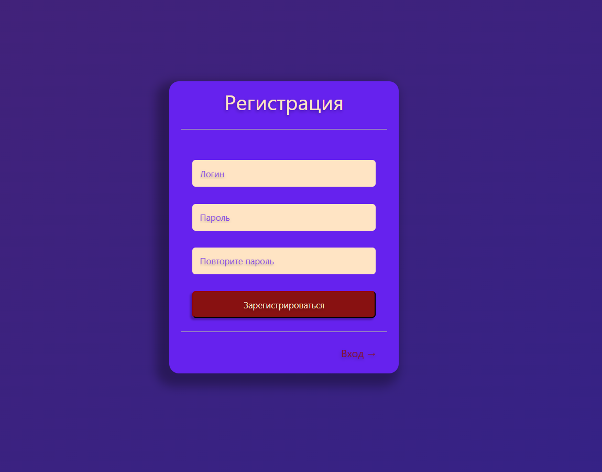
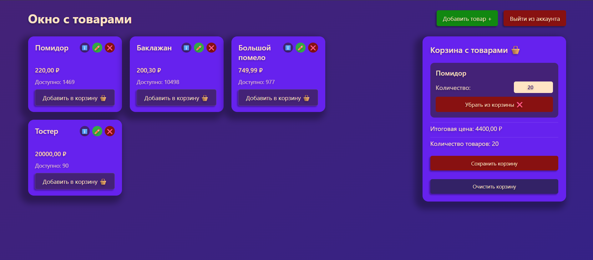
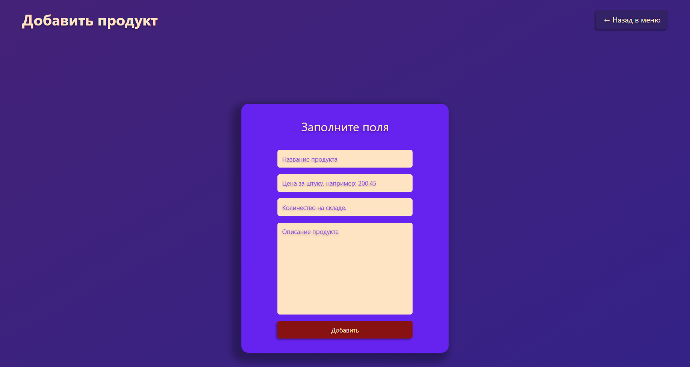
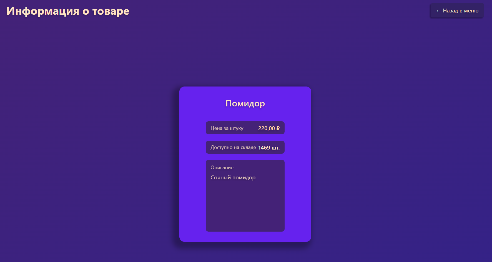

# 🛒 Shopping cart
This web-application developed like a study project for improving my skills. The application is a simple shopping cart, where user can add, watch and change count of products in his cart, before this complete the authorization. User can also log out of his account by clicking the appropriate button. Except of "user" there is another type of role in the system, called "admin". Persone with this role can edit product information (he has access to all CRUD operations related to a product).
## 🛠️ Technology stack
***
  - Asp NET Core
  - MySQL
  - Entity Framework Core
  - JavaScript
  - CSS
  - HTML
  - MVC with Razor Views
***
## ⏳ Development process 
In the beginning, it was necessary to create models that would represent database tables, set up connections between them, and write rules in the DbContext, and then performed the initialization migration.

After that, I developed authentication, authorization and logout functions and connected them to the corresponding windows.

Then I came up with a simple design for the application's main menu.

Next, I created repositories in which I wrote down the functions I needed and placed them in a separate DataManagerService class.

After creating the repositories, I refined the application logic (recalculating the quantity of products in the cart and in the warehouse, ), and also fixed minor bugs that arose during its development.

Afterwards, I connected my server-side component to the client-side component using AJAX requests. This ensured that the user's screen wouldn't flash when confirming changes to the cart.

In parallel with the previous step, I also created input validation, both on the server side and on the client side.

After validating the input, I designed the product information display window.

Finally, I started finalizing the admin functionality. First, I created product editing windows, then linked the previously created methods to them. Next, I added delete and edit buttons to the main menu, and slightly redesigned the product card.

In the end, I did some manual testing and fixed some bugs.
## 💭 How can it be improved?
- Add the user's balance and then recalculate it after clicking the "Pay" button;
- Add a product search bar;
- Add filters for products (vegetables, fruits, dairy products);
- Add a user profile window where the user can customize their profile;
- Add a purchase history so the user can see what they spent their money on;
- Add a product review box and allow users to rate the product they purchased;
- Add a "Ratings" field to the product that will be based on the average rating of all users.
## 🚀 Running the project
1. Clone repository in your PC (use _git clone_ or download zip archive from main page of the repo).
2. If you don't have app "MySQL Workbench" you can load it here: [MySQL Workbench](https://dev.mysql.com/downloads/workbench/) (if you have any DBMS just skip this step).
3. Setting up a connection string:  
   3.1. Open file appsettings.json;  
   3.2. In the quotes (after "DefaultConnection":) write the following string: "Server=localhost;database=yourdbname;pwd=yourpassword;uid=root;port=3306;" (don't forget to enter your data).  
   3.3. If you have another database, than enter connection string for your provider (you can find it in the internet).  
   3.4. And then save file.  
4. Now we need to perform migrations:  
   4.1. Open project in powershell or Visual Studio.  
   4.2. Complete the following commands:
   ```bash  
      dotnet tool install --global dotnet-ef  
      dotnet-ef database update
   ```  
   4.3. If previous command finished with an error than try to write: _dotnet add package Microsoft.EntityFrameworkCore.Design_ and complete it again.
5. Open .csproj file (if you have Visual Studio) and run the project by pressing keyboard shortcut: "Ctrl + F5".
6. If you don't have Visual Studio platform then use powershell (or other command line) and perform the following commands:
```
  dotnet restore
  dotnet build
  dotnet run
```
7. Once the project launches, a console will appear. Find the application's localhost address (something like this: _https://localhost:5001_) and paste it into the search bar of any browser. After that, the application will run normally.
## 📚 What I learned
- Learned how to authenticate and authorize a user (using Cookie Authentication);
- Learned how to work with AJAX requests (using the fetch method with async/await);
- Learned how to create server-side and client-side validation;
- Learned how to work with the Stateless app;
- Strengthened work with the DOM tree;
## 🍿Application Design
<div align="center">
  <h3>Login page</h3>
  
</div>
<div align="center">
  <h3>Registration page</h3>
  
</div>
<div align="center">
  <h3>Main menu (Admin role)</h3>
  
</div>
<div align="center">
  <h3>Edit product page</h3>
  
</div>
<div align="center">
  <h3>View product info page</h3>
  
</div>
